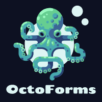
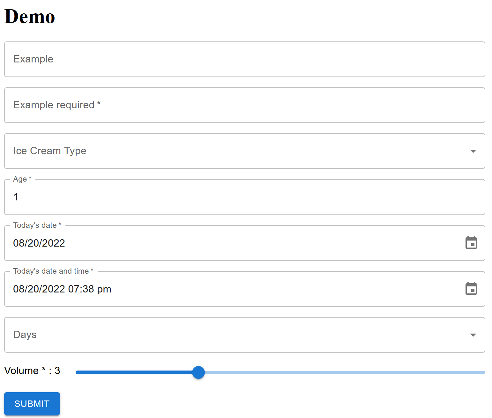

# OctoForm

Write less code to create your forms.

OctoForm is a wrapper that combines Material-UI + react-hook-form + yup using ReactJS.

[Example repository https://github.com/jmaister/octo-form-example]([https://](https://github.com/jmaister/octo-form-example))

# Screenshot



# Install

With npm:

```bash
npm install --save octo-form
```

or yarn:

```bash
yarn add octo-form
```

# Usage

1. Import the component:

```jsx
import { OctoForm } from 'octo-form';
```

2. Create a yup schema

```ts
const iceCreamOptions: OptionLabel[] = [
  { value: "", label: "-- no flavor --" },
  { value: "chocolate", label: "Chocolate" },
  { value: "strawberry", label: "Strawberry" },
  { value: "vanilla", label: "Vanilla" },
];

const dayOptions: OptionLabel[] = [
  { value: "", label: "-- no day --" },
  { value: "Monday", label: "Monday" },
  { value: "Tuesday", label: "Tuesday" },
  { value: "Wednesday", label: "Wednesday" },
  { value: "Thursday", label: "Thursday" },
  { value: "Friday", label: "Friday" },
  { value: "Saturday", label: "Saturday" },
  { value: "Sunday", label: "Sunday" },
];

const schema = yup.object({
  example: yup.string(),
  exampleRequired: yup.string().required(),
  iceCreamType: yup.string().oneOf(iceCreamOptions.filter(o => o.label != "").map(option => option.value.toString())),
  age: yup.number().positive().integer().moreThan(0).required(),
  todaysDate: yup.date().required(),
  todaysDateAndTime: yup.date().required(),
  days: yup.array().of(yup.string().required().oneOf(dayOptions.filter(o => o.label != "").map(option => option.value.toString()))).required(),
  volume: yup.number().positive().integer().min(0).max(10).required(),
});
```

3. Create a form component

```tsx
const onSubmit: SubmitHandler<SampleFormType> = (data) => {
    console.log(data);
  }


<OctoForm defaultValues={defaultValues} schema={schema} onSubmit={onSubmit}>
    <Stack spacing={2}>

      <FormInputText name="example" label="Example" />

      <FormInputText name="exampleRequired" label="Example required" />

      <FormInputDropdown
        name="iceCreamType"
        label="Ice Cream Type"
        options={iceCreamOptions}
      />

      <FormInputText name="age" label="Age" />

      <FormInputDate
        name="todaysDate"
        label="Today's date"
      />

      <FormInputDateTime
        name="todaysDateAndTime"
        label="Today's date and time"
      />

      <FormInputMultiCheckbox
        name="days"
        label="Days"
        options={dayOptions}
      />

      <FormInputSlider
        name="volume"
        label="Volume"
      />

      <Stack direction="row">
        <Button
          type="submit"
          variant="contained"
        >Submit</Button>
      </Stack>
    </Stack>

  </OctoForm>
```

# Links

Based on: https://blog.logrocket.com/using-material-ui-with-react-hook-form/


# TODO

- Provide isSubmitting, isValid, isDirty flags
- If isSubmitting, disable form inputs
- Allow to set Date locale for import esLocale from 'date-fns/locale/es';
- File component
